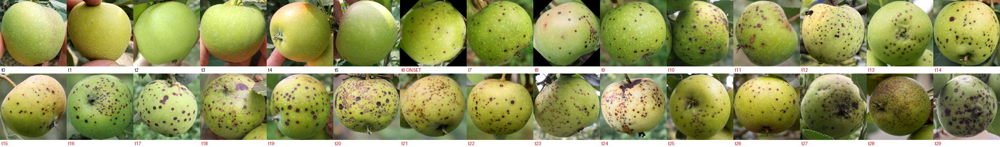

# Long-Horizon Fruit Observation Agent

**Watch one fruit every day for a month. Look cheaply every time, look hard only when memory says it is worth it, and never forget what you saw.**


## The problem

A fruit disease starts as a dot a few millimetres wide and becomes an unsellable fruit in two to three weeks.
Once one infected apple enters cold storage the loss spreads to its neighbours.
Sensors cannot see this. Only a photo can, and a photo has to be taken again and again, for weeks, for every fruit.

Running a frontier vision model on every photo of every fruit is accurate but too expensive to keep on for a season.
Running a small local model only is cheap but misses the early stage.
The agent's job is to decide, **for each fruit, each day**, whether today's photo deserves the expensive look, using what it remembers about that fruit.

## Why this needs an agent, not a threshold

- **Memory across days.** The decision depends on what the same fruit looked like last week, which question was left open, and when the last precise check was. That state lives in Tinybird RawTree and survives restarts.
- **Look-back, not just escalation.** When the precise model runs, it receives the *past photos the memory points to*, so it can confirm a slow change that no single photo shows.
- **Deferred judgement.** A low-cost exit is not a "healthy" verdict. It is "nothing new enough to pay for today." The open question stays in memory until it is answered or expires.

## How it works

| Step | Component | What it does |
| --- | --- | --- |
| 0 | **Nimble** | The agent searches, lists and downloads public apple-fruit photos. 7,516 files with a Nimble task-id per file ([evidence](docs/cover/nimble_evidence.png)). |
| 1 | Input | One photo per fruit per day: fruit ID, day, capture status. |
| 2 | **Liquid LFM2.5-VL** (local) | Runs on every photo. Current features, anomaly candidates, uncertainty. About 2 s per photo, no API cost. |
| 3 | Controller | Reads the fruit's memory and applies explicit rules: new anomaly, change that persists or grows, open question due, too long since the last precise look. |
| 4a | Low cost | Stop after Liquid. Observation and memory are still written. |
| 4b | High cost | **GPT-5** precise analysis on the original photo plus the past photos the memory selects. Names the disease and asks for action. |
| 5 | Write back | Photo reference, why this path was chosen, open question, next check date. |
| 6 | **Tinybird RawTree MCP** | Persistent per-fruit memory, read before every decision. |

## Evaluation

All arms run on the same stream: 12 fruits x 30 days, 360 photos, with hidden ground truth (disease and onset day).

| Arm | Policy | Question it answers |
| --- | --- | --- |
| A | GPT-5 on every photo | Cost ceiling |
| B | Liquid on every photo, GPT-5 by rules, **no long-term memory** | What memory adds |
| C | Liquid on every photo, GPT-5 by memory + rules (ours) | |

Metrics: detection delay after onset, misses, false alarms on healthy fruit, number of GPT-5 calls, cost.
Results are written to `out/scores_episodes.json` by the scorer. **Results are not in yet; this section will be updated when the runs finish.**



*One episode as the agent sees it: healthy for six days, then black pox appears at t6 and spreads.*

## Data, honestly

- Photos: Manalagi Apple Disease Dataset (Mendeley Data, `10.17632/9zgkwwv9j8.6`, CC BY 4.0). Classes: healthy, anthracnose, black pox, powdery mildew.
- Acquired autonomously through Nimble (search, extract, media). Every file carries its Nimble task-id and SHA-1 in `data/apple_nimble/index.csv`.
- **The episodes are not true time series.** No public dataset follows the same fruit through a disease. We ordered photos of *different* apples by lesion size to build a plausible day-by-day sequence. The agent is never told which day the disease starts.

## Sponsors used

Nimble (data acquisition) · Liquid (local vision model, every observation) · Tinybird RawTree MCP (persistent memory). GPT-5 through the OpenAI API for the precise path.

## Repository

```text
tomato_agent/     agent loop: Liquid -> controller -> GPT-5, memory read/write
liquid/           local LFM2.5-VL setup and benchmark
tinybird/         RawTree tables and memory event contract
scripts/          Nimble collection, RawTree MCP probes
docs/             design notes (Korean plan: docs/PLAN_ko.md)
```

## Quick start

```sh
pip install -r requirements.txt
cp .env.example .env            # fill NIMBLE_API_KEY, OPENAI_API_KEY, RawTree settings; .env is git-ignored
python3 -m unittest discover -s liquid -p 'test_*.py'   # rule checks, no model call
python3 scripts/rawtree_mcp_stdio.py --check              # local key and binary check
```

## Team

Three people: an agricultural engineer (RDA, Korea), a front-end developer, and a fluid-dynamics researcher. Built at the Long Horizon Agents Hack, 2026-09-26.
