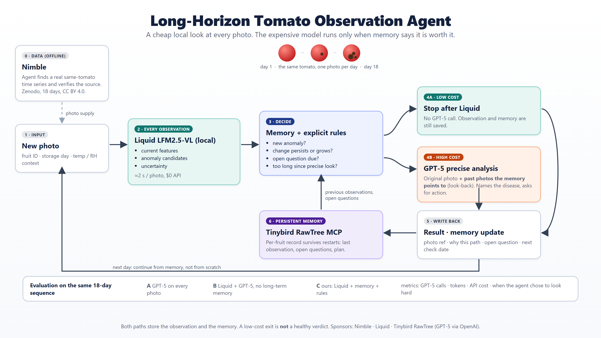
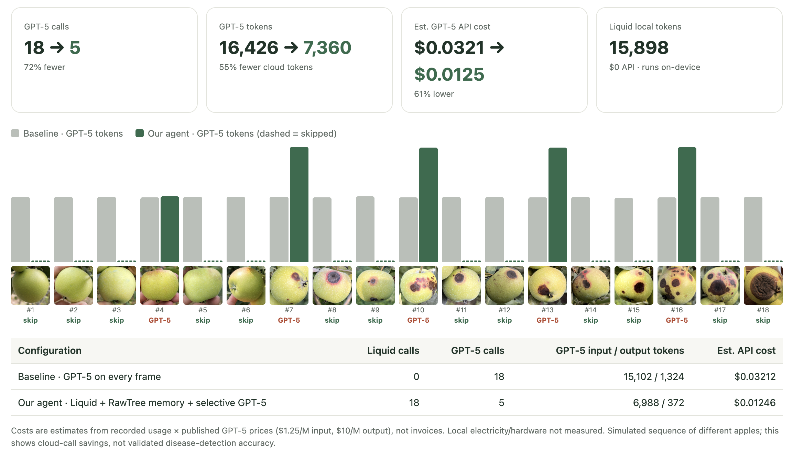
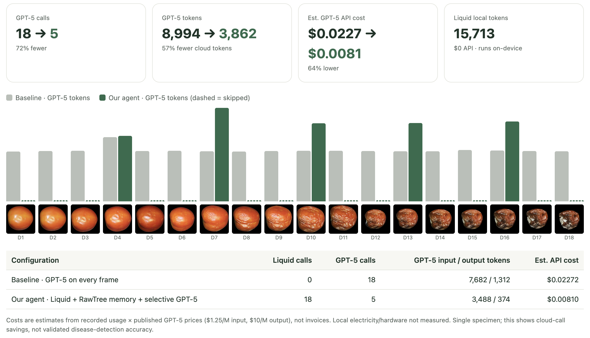
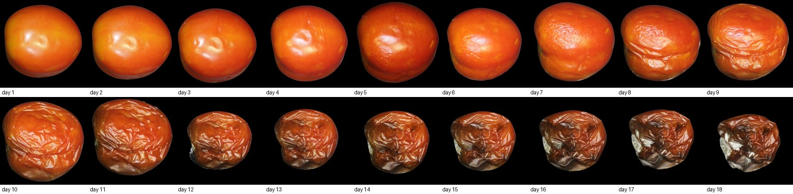

<div align="center">

# Long-Horizon Fruit Observation Agent

**Look cheaply at every photo. Look hard only when memory says so. Never forget what you saw.**

[](https://jeremy-kim98.github.io/Long_Horizon_Agents_Hackathon_0926/reports/tomato_demo.html)




</div>

## The idea in one breath

A fruit disease starts as a dot a few millimetres wide and turns into an unsellable fruit in two or three weeks. Sensors cannot see it. A photo can, but only if the same fruit is photographed again and again and each photo is judged against what that fruit looked like before.

Sending every photo to a frontier vision model is accurate and wasteful. Using only a small local model is cheap and misses the day the dot starts to grow. So the agent decides, **per fruit, per day**, how hard to look, and it decides from memory.

## Results

Same 18-frame sequence, two policies. Baseline sends every frame to GPT-5. Our agent runs Liquid locally on every frame and lets memory plus explicit rules decide when GPT-5 is worth it.

| | GPT-5 calls | GPT-5 tokens | Est. cloud cost | Liquid (local, $0) |
| --- | ---: | ---: | ---: | ---: |
| **Apple** · baseline | 18 | 16,426 | $0.0321 | 0 |
| **Apple** · our agent | **5** (−72 %) | 7,360 (−55 %) | **$0.0125** (−61 %) | 18 calls |
| **Tomato** · baseline | 18 | 8,994 | $0.0227 | 0 |
| **Tomato** · Liquid + rules, **no memory** | 16 | 8,020 | $0.0203 | 18 calls |
| **Tomato** · our agent | **5** (−72 %) | 3,862 (−57 %) | **$0.0081** (−64 %) | 18 calls |

<p align="center"></p>
<p align="center"><sub><b>Apple.</b> 18 frames of different apples ordered by lesion size (Manalagi dataset, fetched with Nimble). Dashed = the agent skipped GPT-5 that day.</sub></p>

<p align="center"></p>
<p align="center"><sub><b>Tomato.</b> One real tomato photographed on 18 consecutive storage days (Zenodo 21943147). Same policy, same savings.</sub></p>

**What memory does.** Without memory every "anomaly: yes" from Liquid is new, so GPT-5 fires almost daily (16 of 18). With memory the agent knows the lesion was already confirmed, suppresses the repeats, and keeps only a 72-hour safety re-check, so 16 calls become 5. Days 4, 7, 10, 13 and 16 are that safety cap; the saving between 16 and 5 is the memory.

Costs are recorded usage × published GPT-5 prices ($1.25 / M input, $10 / M output), not invoices. Neither sequence has disease ground truth, so we report calls and cost, not detection accuracy. See [Limits](#limits).

## Why an agent and not a threshold

- **Memory across days.** Whether today deserves the expensive look depends on last week's photo, the question left open, and when the last precise check was. That state lives in Tinybird RawTree and survives process restarts.
- **Look-back, not just escalation.** When GPT-5 runs it receives the past frames the memory points to, so it can confirm a slow change that no single photo shows.
- **Deferred judgement.** A low-cost day is not a "healthy" verdict. It means "nothing new enough to pay for today." The open question stays in memory until it is answered or expires.

## How it works

| Step | Component | What happens |
| --- | --- | --- |
| 0 | **Nimble** | The agent searches, verifies and downloads public fruit photos. 7,516 apple images with a Nimble task-id per file; the 18-day tomato series found and its source page verified. |
| 1 | Input | One photo per fruit per day: fruit ID, day, capture status. |
| 2 | **Liquid LFM2.5-VL-1.6B** (local) | Runs on every photo. Visible features, anomaly candidates, uncertainty. ~2 s per frame, no API cost. |
| 3 | Controller | Restores the fruit's memory and applies explicit rules: new anomaly, change that persists or grows, open question due, too long since the last precise look. |
| 4a | `LOW_COST_ONLY` | Stop after Liquid. Observation and memory are still written. |
| 4b | `HIGH_COST_ANALYSIS` | **GPT-5** on the original photo plus the past evidence the memory selects. |
| 5 | Write back | Photo reference, why this path, open question, next check condition. |
| 6 | **Tinybird RawTree MCP** | Persistent per-fruit memory, restored before every decision. |

## Data

| Sequence | Source | What it is | Licence |
| --- | --- | --- | --- |
| Apple | [Manalagi Apple Disease Dataset](https://data.mendeley.com/datasets/9zgkwwv9j8/6), Mendeley | 7,516 photos fetched autonomously through Nimble (search → extract → media), task-id and SHA-1 per file. The 18-frame run is **different apples ordered by lesion size**, not one fruit over time. | CC BY 4.0 |
| Tomato | [Zenodo 21943147](https://zenodo.org/records/21943147) | **The same tomato** photographed on 18 consecutive storage days, with daily temperature, humidity, eCO2 and TVOC. 19 files MD5-verified; provenance in `data/samples/tomato_18day/provenance.json`. | CC BY 4.0 |

The agent receives frames in order and is never shown a future frame.

<p align="center"></p>

## Limits

- One apple sequence assembled from different fruits and one real tomato. No disease labels, so recall, false alarms and detection delay are `null`, not zero.
- ~2 s per frame for Liquid is from our 4-image benchmark on an M-series laptop, not a fleet measurement.
- Cost figures are price-list estimates. Local electricity and hardware are not counted.
- Policy `tomato-two-path-v1` was fixed before replay. This is a development demonstration, not a field trial.

## Run it

```sh
pip install -r requirements.txt
cp .env.example .env     # OPENAI_API_KEY, RAWTREE_API_KEY, NIMBLE_API_KEY   (.env is git-ignored)

python3 scripts/collect_tomatoes.py                        # fetch and verify the 18-day tomato sequence
python3 -m unittest discover -s tests -p 'test_*.py'       # policy / storage / budget / restart, no model calls

python3 -m tomato_agent run --variant A --backend local   --run-id demo_a     # GPT-5 every frame
python3 -m tomato_agent run --variant C --backend rawtree --run-id demo_c     # ours: Liquid + RawTree memory + rules
python3 -m tomato_agent report data/runs/demo_a data/runs/demo_c --output reports/tomato_demo.html
```

Budget caps, restart recovery and the memory event contract: [docs/runtime.md](docs/runtime.md) · [docs/tinybird_memory.md](docs/tinybird_memory.md).

## Repository

```text
tomato_agent/   agent loop: Liquid → controller → GPT-5, memory read/write, restart recovery
liquid/         local LFM2.5-VL setup, benchmark, routing guard tests
tinybird/       RawTree tables and memory event contract
scripts/        Nimble collection, tomato fetch + verify, RawTree MCP probes
reports/        replay viewer (tomato_demo.html) and numbers (tomato_demo.json)
docs/           runtime.md · tomato_data.md · cover/ (figures) · PLAN_ko.md (original plan, Korean)
```

## Built with

**Nimble** data discovery and acquisition · **Liquid** LFM2.5-VL local vision on every frame · **Tinybird RawTree MCP** persistent memory · GPT-5 (OpenAI) for the precise path.
