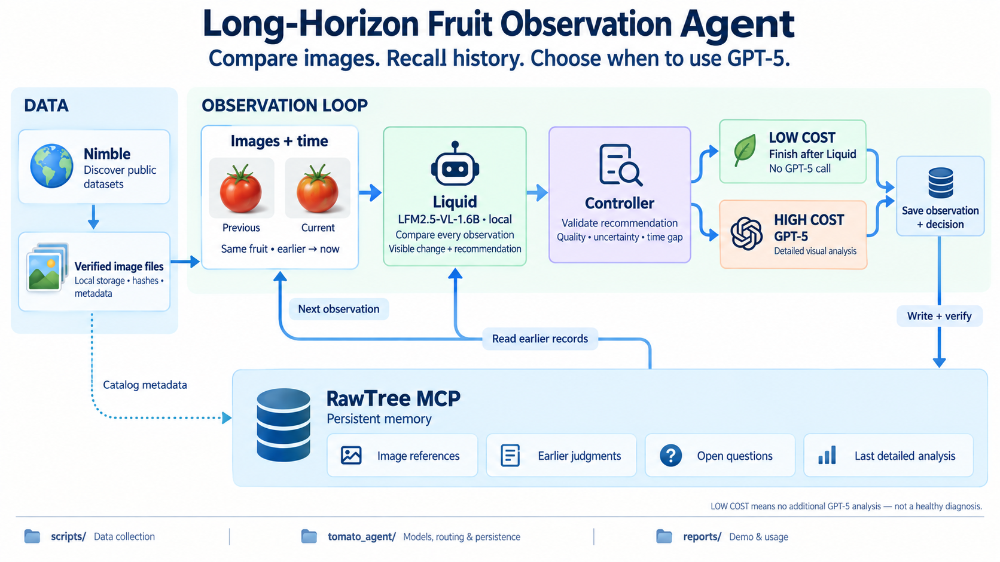
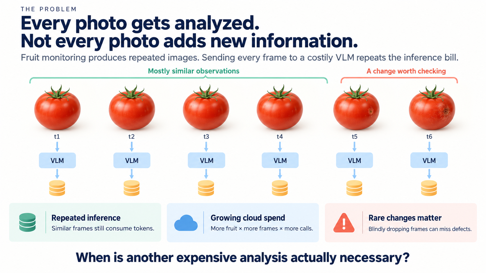

# Long-Horizon Fruit Observation Agent



**Liquid observes each frame locally. A controller decides when to call GPT-5. RawTree stores the history.**

## Run locally

Requires Python 3 and Git. Clone the repository, then start the demo:

```sh
git clone https://github.com/Sehyeogkim/Long_Horizon_Agents_Hackathon_0926.git
cd Long_Horizon_Agents_Hackathon_0926
python3 -m http.server 8770 --bind 127.0.0.1
```

Open **[http://127.0.0.1:8770/reports/index.html](http://127.0.0.1:8770/reports/index.html)**.

Already cloned? Run only the last command from the repository folder. No API keys, package installation, or model downloads are needed for this **saved-results demo**.

## Problem statement



## Demo walkthrough

1. **Data** — RawTree catalog: 2,244 tomato files and 7,516 distinct apple file IDs; inspect saved database query evidence.
2. **Tomato** — 18 photos of one tomato over 18 days; Liquid-only and GPT-5 cases, plus cloud token comparison.
3. **Apple** — 18 different apples in a simulated progression; the same walkthrough.

**Baseline:** GPT-5 on every frame. **Low cost:** finish after Liquid; this does not mean healthy.

**Experiment status:** All GPT-5 calls in the displayed agent runs came from the 72-hour recheck rule. Liquid-driven escalation and diagnostic accuracy remain unvalidated; routing is under investigation.

[RawTree integration](docs/tr6_rawtree.md) · [Database evidence](reports/demo_database_evidence.json) · [Live agent setup](docs/runtime.md) · [Dataset credits](reports/demo_assets/CREDITS.md)
