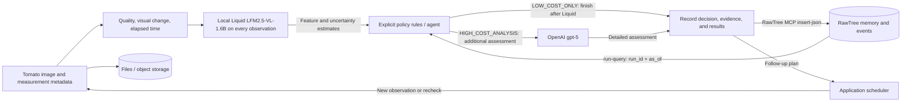

# RawTree MCP memory contract for the tomato observation agent

Design checkpoint: 2026-09-25. **MCP authentication, reads, catalog insertion, and readback were verified at this checkpoint; agent memory recovery and model inference were not yet implemented.** Subsequent implementation and verification are documented in [runtime storage](rawtree_runtime.md) and [runtime instructions](runtime.md).

The active subject is repeated observation of the same tomato. The chosen low-cost stage is local Liquid `LFM2.5-VL-1.6B` feature extraction, and the detailed stage is OpenAI `gpt-5`. Tomato inference quality and the complete policy loop require separate validation. Original images remain in files or object storage; RawTree stores references and events. RawTree is a Tinybird product with a separate connection from generic Tinybird MCP. [Official product page](https://rawtree.com/)

## Verified connections

The following **generic Tinybird MCP** calls were made in this session. Their results are not evidence of a RawTree connection.

| Call | Result |
| --- | --- |
| `execute_query`: `SELECT 1 AS connection_ok` | `connection_ok = 1` |
| `list_datasources` | `[]` |
| `list_endpoints` | `[]` |

The generic Tinybird connection and reads worked, with no exposed data sources or published endpoints. **The requested integration is RawTree MCP. The official `@rawtree/mcp@0.3.2` stdio server successfully authenticated, initialized, discovered 37 tools, returned `SELECT 1 → 1`, and listed tables.** Generic Tinybird is not a substitute. Evidence: `data/catalog/rawtree/stdio_connection.json`. Subsequently, one real apple sample metadata record was stored in `apple_lha_dataset_catalog` using `insert-json`. Readback by `event_id` confirmed its 32 frames, license, and verification status. Evidence: `data/catalog/rawtree/catalog_insert.json` and `catalog_read.json`.

The RawTree database already contains multiple tables, including generic names such as `observations` and `agent_events`. Do not reuse those names directly. Tomato data uses the dedicated `tomato_lha_` prefix together with `run_id`. The apple sample in `apple_lha_dataset_catalog` and its connection evidence remain historical verification records: do not delete, rename, or relabel them as tomato data. Other existing table contents were not read or modified.

The official hosted MCP endpoint is `https://mcp.rawtree.com/mcp`. The following commands configure Codex. After OAuth login, discover organizations, clusters, and databases to select the exact target. Hosted registration and OAuth were verified, but the current Codex registration was switched to the project-key stdio method below. [Official RawTree MCP documentation](https://rawtree.com/docs/reference/mcp)

```sh
codex mcp add rawtree --url 'https://mcp.rawtree.com/mcp'
codex mcp login rawtree
```

For OAuth, verify `list-organizations` → `list-clusters` → `list-databases`, then `list-tables` and `run-query: SELECT 1 AS connection_ok` in the selected scope. API key access uses a separate `RAWTREE_API_KEY`; generic Tinybird tokens are not reused. A key belongs to an organization and cluster. Omitting the database selects the key's default database. This validation used that default; application deployment should explicitly pin the target database. [RawTree authentication documentation](https://rawtree.com/docs/reference/authentication)

## Stdio connection using the project key

The official local `@rawtree/mcp` server reads `RAWTREE_API_KEY` from its environment. `scripts/rawtree_mcp_stdio.py` reads only RawTree settings from the project's `.env` and passes them to the child environment. It does not write the key to Codex configuration, command-line arguments, or logs, and does not use shell source/eval. The package is pinned to `@rawtree/mcp@0.3.2`. [Official MCP implementation](https://github.com/rawtreedb/rawtree-mcp)

```sh
python3 '/Users/jeff/project/Long_Horizon_Agents_Hackathon_0926/scripts/rawtree_mcp_stdio.py' --check
# Command used for the actual Codex registration
codex mcp add rawtree -- /usr/bin/python3 '/Users/jeff/project/Long_Horizon_Agents_Hackathon_0926/scripts/rawtree_mcp_stdio.py'
```

`--check` checks only key presence and the npx executable, not remote authentication. Actual validation requires `initialize`/`tools/list`, followed by `run-query` with `SELECT 1` and `list-tables`. API key connections do not require the OAuth-only `list-organizations` step. The first run may download the official package through npx. The current `rawtree` registration uses this stdio wrapper. Python requests to hosted HTTP were blocked by Cloudflare 1010 and were not retried; the official local MCP server verified the connection. This is distinct from an API key authentication failure.

## Read, write, and execution boundaries



RawTree MCP reads SQL through `run-query` and writes events through `insert-json`. `insert-from-url` ingests public URL data. **Generic Tinybird Events API is not required for RawTree writes.** Interactive MVP operation prioritizes RawTree MCP; larger runtime ingestion can use RawTree's own SDK/API. [RawTree MCP](https://rawtree.com/docs/reference/mcp), [RawTree ingestion guide](https://rawtree.com/docs/guides/ingest-data)

RawTree creates a table on the first JSON insert and supports dynamic fields, so this design does not create Tinybird `.datasource`/`.pipe` files. The following is an application **event contract**, not prerequisite DDL. After writing, query the same `event_id` to check visibility and contents. Retries reuse the same ID and payload, without assuming server-side deduplication. The application scheduler resumes work; a `next_check_at` database field does not execute a task by itself.

## Observations, model estimates, and decisions

- **Observed facts:** original images, capture time/order, actual measurements, provenance, and hashes. Store these in `observations`. Calculated image-quality or change metrics carry the calculation method and version.
- **Liquid estimates:** local `LFM2.5-VL-1.6B` structures visible color, spots, shape, occlusion, and assessment uncertainty. Store results in `model_calls.result_json` with `output_kind=visual_features`. Model descriptions and self-reported confidence are not promoted to observed facts or calibrated probabilities.
- **Action decisions:** **versioned explicit rules** jointly evaluate the current input and change history, unresolved questions, and last-analysis time restored from external RawTree memory. Record the action, matched rules, and input evidence in `agent_events`. Do not execute Liquid's `next_action` output.
- **Detailed assessment:** Liquid runs for every observation. Only when the rules choose `HIGH_COST_ANALYSIS` are the current image and necessary historical evidence sent to `gpt-5`. Its `output_kind=strong_assessment` result remains a model estimate, separate from verified ground truth.

Rules evaluate poor image quality, persistent or increasing changes, due follow-up questions, and elapsed time since the last detailed analysis. Conditions and thresholds are pinned with `policy_version` and validated on development data. Rechecks do not guarantee recall. Run one Liquid feature extraction per observation and add at most one GPT-5 call on the high-cost path. Evaluate whether unresolved questions have reached their due time or condition; their mere existence must not cause repeated calls. RGB change alone does not determine the action. Store unusable quality as `quality_status=unusable` and `review_required=true`, and retain a request for another image. Both cost paths preserve observations, image references, and memory. Record call failures and retries separately in `status`; do not treat them as successful completion.

`memory_events` separates `observed_facts_json`, `model_estimates_json`, and `review_outcomes_json`, preserving source observation/call/review IDs for every item. Restarting the process must not mix measured image values, model-inferred states, and outcomes confirmed by review.

## Common event rules

| Field | Proposed type | Contract |
| --- | --- | --- |
| `event_id` | String | Stable across retries; derived from `run_id + event_kind + logical_record_id + record_version` |
| `schema_version` | UInt16 | Payload structure version, initially 1 |
| `record_version` | UInt64 | Revision of the same logical record; prior rows are not overwritten |
| `run_id` | String | Unique per replay and experimental arm; no memory sharing across runs |
| `dataset_id`, `dataset_version` | String | Immutable input manifest version |
| `sequence_id`, `entity_id` | String | Sequence and individual tomato identifiers; uniqueness within the dataset is sufficient |
| `event_at` | DateTime64(3, 'UTC') | Event time on the **run's logical clock** |
| `available_at` | DateTime64(3, 'UTC') | Logical time when the agent could use the information |
| `ingested_at` | DateTime64(3, 'UTC') | Actual ingestion time, distinct from replay and observation times |
| `synthetic` | UInt8 | 0 for real observations, 1 for generated/synthetic data; separate in experiments and reports |

`dataset_catalog` is independent of execution, so it uses `catalog_entry_id` and `catalog_version` instead of `run_id` and `entity_id`. Pin catalog and file-manifest versions at run start. Do not silently apply changed licenses or labels to earlier experiments.

Preserve a known actual capture time in `observed_at`. If unknown, keep it NULL and record source evidence in `frame_index`, `elapsed_ms`, and `time_basis`. A logical clock for a sequence with known ordering only is a replay mechanism, not a claimed capture timestamp. If actual elapsed time is unavailable, do not report detection delay in seconds or days.

## JSON event contracts by RawTree table

Types below are logical application-validation types, not RawTree DDL. JSON timestamps are ISO 8601 UTC strings; UInt/Float values are JSON numbers. Preserve extensions as nested JSON. Fields ending in `_json` are objects/arrays without double-encoding. All runtime rows include the common keys above. The table lists logical names; proposed physical names are `tomato_lha_observations`, `tomato_lha_agent_events`, `tomato_lha_memory_events`, `tomato_lha_model_calls`, and `tomato_lha_dataset_catalog`. At this design checkpoint, these tomato tables had not yet been created or populated; see the runtime documents for subsequent verification.

| Table / row grain | Additional fields | Purpose |
| --- | --- | --- |
| `observations` / one version of an observation exposed to a run | `observation_id String`, `frame_uri String`, `frame_sha256 String`, `observed_at Nullable(DateTime64)`, `frame_index UInt64`, `elapsed_ms Nullable(UInt64)`, `time_basis String`, `state_json Object`, `quality_json Object`, `provenance_json Object` | Input image, measurements, and provenance. `state_json` preserves values, units, measurement time, specimen scope, and reasons for missingness |
| `agent_events` / one action decision for an observation | `decision_id String`, `observation_id String`, `action String`, `quality_status String`, `review_required Bool`, `policy_version String`, `reason String`, `prediction_json Object`, `selected_by String`, `rule_inputs_json Object`, `matched_rule_ids Array(String)`, `evidence_observation_ids Array(String)`, `memory_event_ids Array(String)`, `model_call_ids Array(String)`, `decision_as_of DateTime64`, `status String` | One of `LOW_COST_ONLY` / `HIGH_COST_ANALYSIS` with evidence. Both run Liquid; only the latter adds GPT-5. Another-image requests remain in `review_required`. `selected_by=explicit_policy`; Liquid's `next_action` does not select the action |
| `memory_events` / one version of a complete specimen memory snapshot | `memory_key String`, `summary String`, `observed_facts_json Array(Object)`, `model_estimates_json Array(Object)`, `review_outcomes_json Array(Object)`, `evidence_observation_ids Array(String)`, `open_questions_json Array(Object)`, `next_check_at Nullable(DateTime64)`, `next_check_condition String`, `last_observation_at Nullable(DateTime64)`, `last_cheap_analysis_at Nullable(DateTime64)`, `last_strong_analysis_at Nullable(DateTime64)`, `cause_decision_id String`, `parent_memory_event_id String`, `status String` | Restore after restart. Every question preserves `question_id`, status, evidence, first-raised time, and resolution time |
| `model_calls` / one version of a physical API or local inference attempt | `call_id String`, `attempt_id String`, `decision_id String`, `observation_id String`, `purpose String`, `provider String`, `model String`, `model_version String`, `prompt_version String`, `output_kind String`, `result_json Object`, `image_count UInt32`, `input_tokens Nullable(UInt64)`, `output_tokens Nullable(UInt64)`, `thinking_tokens Nullable(UInt64)`, `latency_ms Nullable(UInt64)`, `local_compute_ms Nullable(UInt64)`, `amount Nullable(Float64)`, `currency String`, `cost_basis String`, `status String` | Distinguish Liquid features from `gpt-5` detailed assessment. Meter any additional model-based decision or summarization calls. Explicit rule execution is not a model call. Separate retry costs, price estimates, and actual billing |
| `dataset_catalog` / one version of an acquisition candidate or file manifest | `catalog_entry_id String`, `catalog_version UInt64`, `schema_version UInt16`, `dataset_id String`, `source_url String`, `file_url String`, `local_path String`, `sha256 String`, `license String`, `license_url String`, `discovery_tool String`, `discovered_at DateTime64`, `verified_at Nullable(DateTime64)`, `entity_id_evidence String`, `temporal_evidence String`, `label_evidence String`, `download_status String`, `bytes Nullable(UInt64)`, `synthetic UInt8`, `verification_status String` | Distinguish search results from verified/downloaded data. Use `discovery_tool=nimble` only with evidence of an actual Nimble call |

Keep evaluation ground truth and `label_available_at` in a separate evaluation store. Do not put ground-truth columns in agent-facing `observations`. Future `evaluation_results` are identified by `run_id + evaluator_version + dataset_version` and excluded from agent SQL access.

## Temporal cutoff and experiment isolation

Queries require `run_id`, `dataset_id`, `dataset_version`, `sequence_id`, `entity_id`, and `as_of`. The cutoff uses the run's logical clock, never wall-clock `now()`. If adjacent actions share a millisecond, add an ordered `step_index` and use `(as_of, as_of_step)`.

1. First filter candidate rows by `event_at <= as_of AND available_at <= as_of`.
2. Retransmissions of an `event_id` must have identical payloads; reject conflicts at ingestion.
3. Select the latest `record_version` for each logical key only from candidates that passed the temporal filter. Selecting the latest version across all history first can leak future revisions.
4. Supporting observations, decisions, and model calls must satisfy the same run, entity, and temporal boundaries.
5. Experiments initialized with prior memory must explicitly pin a separate `seed_memory_snapshot` and version. Standard A/B/C comparisons do not share memory across runs.

`memory_key` is `dataset_id / dataset_version / sequence_id / entity_id`, with `run_id` providing the execution boundary. Observation history returns the latest eligible version per `observation_id`. Memory events are complete snapshots, so the latest eligible event for a `memory_key` restores its state. An empty result means no memory; do not substitute another run.

## Proposed application query functions

Each function calls RawTree MCP `run-query`. These are application function designs, not already-published database endpoints.

| Proposed name | Additional inputs | Returns |
| --- | --- | --- |
| `entity_memory_as_of` | Common required inputs | Latest memory snapshot within the temporal cutoff, or an empty result |
| `entity_observations_as_of` | Common required inputs, `limit` | Latest eligible version per observation, in time order, with source references, quality, and measurements |
| `run_model_usage` | `run_id`, `as_of` | Deduplicate the latest status per `attempt_id`, then aggregate by provider/model/purpose/currency/cost_basis |
| `dataset_catalog_version` | `dataset_id`, `catalog_version` | The verification/download manifest pinned by the run |

Memory-free experiment B receives only operational state needed for common recheck rules, such as the last observation/analysis times. It does not use memory summaries, past inferences, or unresolved-question queries. `LOW_COST_ONLY` still runs Liquid, so success updates `last_cheap_analysis_at`. Update `last_strong_analysis_at` only after successful GPT-5 assessment. Finishing on the low-cost path does not establish that the specimen is healthy.

The sequential MVP uses a single writer per entity/run. RawTree's analytical event log is not assumed to be a task lock or transactional state store. On restart, a writer reads the latest version and links the next event through `parent_memory_event_id`. Concurrent writers would require a separate coordination layer. Persist before starting the next decision, and retain failed writes in a local outbox.

## Implementation and validation plan recorded at the design checkpoint

1. Verify missing fields, temporal evidence, and specimen identity in tomato samples. Keep the earlier apple sample only as acquisition/MCP verification history.
2. Authentication and basic reads were complete. Before ingestion, pin the database and project table prefix, and implement JSON validation and temporal-cutoff SQL.
3. Insert normal events, duplicate retries, future revisions, and another run's events to verify deduplication and temporal isolation. These are actual remote writes, outside the original design-only update.
4. Verify that unresolved questions and follow-up plans recover after writing memory and restarting.
5. Validate tomato Liquid features → explicit rules → optional `gpt-5`, plus memory writes, time-bounded reads, and restart recovery before declaring the tomato agent memory loop verified.

At that checkpoint, official stdio MCP initialization, discovery of 37 tools, `SELECT 1`, table listing, and one apple catalog insertion/readback had passed. Tomato event ingestion, temporal reads, runtime memory recovery, model inference, and the policy loop were still pending. See [runtime storage verification](rawtree_runtime.md) and [runtime instructions](runtime.md) for later progress.
