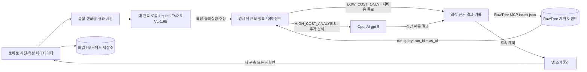

# 토마토 관측 에이전트의 RawTree MCP 기억 계약

작성일: 2026-09-25. **MCP 인증·읽기·카탈로그 쓰기/재조회 검증 완료. 에이전트 기억 복원과 모델 추론은 구현 전이다.** 활성 대상은 동일 토마토 열매의 반복 관측이다. 저비용 단계는 로컬 Liquid `LFM2.5-VL-1.6B` 특징 추출, 정밀 단계는 OpenAI `gpt-5`로 확정했다. 두 모델의 토마토 추론 품질과 전체 정책 루프는 별도로 검증한다. 이미지 원본은 파일/오브젝트 저장소에 두고 RawTree에는 참조와 이벤트를 저장한다. RawTree는 Tinybird 제품이며 일반 Tinybird MCP와 별도 연결이다. [공식 제품 페이지](https://rawtree.com/)

## 실제 연결 확인

현재 세션에서 아래 **일반 Tinybird MCP** 도구를 직접 호출했다. 이 결과는 RawTree 연결 증거가 아니다.

| 호출 | 결과 |
| --- | --- |
| `execute_query`: `SELECT 1 AS connection_ok` | `connection_ok = 1` |
| `list_datasources` | `[]` |
| `list_endpoints` | `[]` |

일반 Tinybird 연결과 읽기는 정상이며 노출된 데이터 소스와 게시 endpoint는 없다. **사용자가 요청한 것은 RawTree MCP다. 공식 `@rawtree/mcp@0.3.2` stdio 서버로 인증·초기 연결·도구 37개 조회·`SELECT 1 → 1`·테이블 목록 조회까지 성공했다.** 일반 Tinybird를 대체 구현으로 진행하지 않는다. 증거: `data/catalog/rawtree/stdio_connection.json`. 후속으로 `apple_lha_dataset_catalog`에 실제 사과 샘플 메타데이터 1건을 `insert-json`으로 저장하고, `event_id`로 재조회하여 32프레임·라이선스·검증 상태가 일치함을 확인했다. 증거: `data/catalog/rawtree/catalog_insert.json`, `catalog_read.json`.

현재 RawTree DB에는 기존 테이블이 여러 개 있으며 `observations`, `agent_events` 같은 일반 이름도 이미 사용 중이다. 아래 논리 테이블명을 그대로 재사용하지 말고 향후 토마토 데이터에는 신규 전용 `tomato_lha_` 접두사와 `run_id`를 함께 사용한다. 기존 `apple_lha_dataset_catalog`의 사과 샘플 1건과 연결 증거는 역사적 검증 기록으로 보존하며 삭제·이름 변경·토마토 라벨 재부여를 하지 않는다. 다른 기존 테이블 내용은 조회·수정하지 않았다.

공식 RawTree hosted MCP는 `https://mcp.rawtree.com/mcp`이며 Codex 연결은 아래와 같다. OAuth 로그인 후 조직·클러스터·DB를 조회하여 정확한 대상을 선택한다. Hosted 등록·OAuth도 확인했으나 현재 Codex 등록은 아래의 프로젝트 키 기반 stdio 방식으로 전환했다. [공식 RawTree MCP 문서](https://rawtree.com/docs/reference/mcp)

```sh
codex mcp add rawtree --url 'https://mcp.rawtree.com/mcp'
codex mcp login rawtree
```

연결 확인 순서는 `list-organizations` → `list-clusters` → `list-databases` → 선택 범위의 `list-tables`와 `run-query: SELECT 1 AS connection_ok`다. API key 방식은 별도 `RAWTREE_API_KEY`를 사용하며 일반 Tinybird token을 재사용하지 않는다. 키는 조직·클러스터에 속한다. DB를 생략하면 키에 연결된 기본 DB가 사용된다. 이번 검증은 기본 DB를 사용했으며, 앱 배포 시에는 대상 DB를 명시적으로 고정한다. [RawTree 인증 문서](https://rawtree.com/docs/reference/authentication)

## 프로젝트 키를 사용하는 stdio 연결

공식 로컬 서버 `@rawtree/mcp`는 `RAWTREE_API_KEY` 환경 변수를 받는다. 프로젝트의 `scripts/rawtree_mcp_stdio.py`는 `.env`에서 RawTree 관련 값만 읽어 자식 프로세스 환경에 전달한다. 키를 Codex 설정·명령행 인자·로그에 기록하지 않으며 shell source/eval을 사용하지 않는다. 패키지는 `@rawtree/mcp@0.3.2`로 고정했다. [공식 MCP 구현체](https://github.com/rawtreedb/rawtree-mcp)

```sh
python3 '/Users/jeff/project/Long_Horizon_Agents_Hackathon_0926/scripts/rawtree_mcp_stdio.py' --check
# 실제 Codex 등록에 사용한 명령
codex mcp add rawtree -- /usr/bin/python3 '/Users/jeff/project/Long_Horizon_Agents_Hackathon_0926/scripts/rawtree_mcp_stdio.py'
```

`--check`는 키 존재와 npx 실행 경로만 확인하며 원격 인증 성공을 뜻하지 않는다. 실제 연결은 `initialize`/`tools/list` 후 `run-query`의 `SELECT 1`과 `list-tables` 응답으로 검증한다. API key 연결에는 사용자 OAuth가 필요한 `list-organizations`를 선행 조건으로 두지 않는다. 첫 실행에 npx가 공식 패키지를 다운로드할 수 있다. 현재 `rawtree` 등록은 이 stdio 래퍼를 사용한다. Hosted HTTP에 대한 Python 요청은 Cloudflare 1010으로 차단되어 재시도하지 않았고 공식 로컬 MCP 서버로 연결을 검증했다. 이는 API 키 인증 실패와 구분한다.

## 읽기·쓰기·실행 경계



RawTree MCP는 `run-query`로 SQL을 읽고 `insert-json`으로 이벤트를 쓸 수 있다. `insert-from-url`은 공개 URL 자료를 수집한다. 따라서 **RawTree 쓰기에 일반 Tinybird Events API가 필수라는 설명은 적용되지 않는다.** MVP의 대화형 운영은 RawTree MCP를 우선하고 대량 런타임 수집이 필요하면 RawTree 자체 SDK/API를 사용한다. [RawTree MCP](https://rawtree.com/docs/reference/mcp), [RawTree 수집 가이드](https://rawtree.com/docs/guides/ingest-data)

RawTree는 처음 JSON을 넣을 때 테이블을 자동 생성하고 동적 필드를 처리하므로 Tinybird `.datasource`/`.pipe`를 만들지 않는다. 아래는 사전 DDL이 아니라 앱의 **이벤트 계약**이다. 쓰기 성공 후 같은 `event_id`를 조회해 가시성과 내용을 확인한다. 재시도는 동일 ID·payload를 사용하되 서버가 자동 중복 제거한다고 가정하지 않는다. 스케줄러가 후속 실행을 담당하며 DB의 `next_check_at` 필드만으로 작업이 실행되지는 않는다.

## 관측·모델 추정·행동 결정의 경계

- **관측 사실:** 원본 사진, 촬영 시각·순서, 실제 측정값, 출처·해시. `observations`에 기록한다. 영상 품질이나 변화량을 계산한 값에는 계산 방법과 버전을 붙인다.
- **Liquid 모델 추정:** 로컬 `LFM2.5-VL-1.6B`는 눈에 보이는 색·반점·형태·가림 등의 특징과 판독 불확실성을 구조화한다. `model_calls.result_json`에 `output_kind=visual_features`로 저장한다. 모델의 설명·자기 보고 confidence는 관측 사실이나 검증된 확률로 승격하지 않는다.
- **행동 결정:** 외부 RawTree 기억에서 복원한 변화 이력·미해결 질문·마지막 분석 시각과 현재 입력을 **버전 있는 명시적 규칙**이 함께 평가한다. `agent_events`에 선택 행동·일치한 규칙·입력 근거를 남긴다. Liquid가 반환하는 `next_action`은 실행 판단에 사용하지 않는다.
- **정밀 판독:** 매 관측 Liquid를 실행한 뒤 규칙이 `HIGH_COST_ANALYSIS`를 선택할 때만 `gpt-5`에 현재 사진과 필요한 과거 근거를 보낸다. 결과는 `output_kind=strong_assessment`인 모델 추정이며 검증된 정답과 구분한다.

규칙은 영상 품질 불량, 변화의 지속·확대, 미해결 질문의 재확인 시점, 마지막 정밀 분석 이후 경과 시간 등을 평가한다. 조건·임계값은 `policy_version`과 함께 고정하고 개발용 데이터에서 검증한다. 재확인 장치는 탐지율 보장이 아니다. 한 관측당 Liquid 특징 추출 1회를 실행하고 고비용 경로에서만 GPT-5를 최대 1회 추가한다. 미해결 질문은 재확인 시각·조건에 도달했는지 평가하며, 존재 자체만으로 반복 호출하지 않는다. RGB 변화량 단독으로 결정하지 않는다. 품질 불량은 `quality_status=unusable`과 `review_required=true`로 저장하고 재촬영 과제를 남긴다. 두 비용 경로 모두 관측·사진 참조·기억을 보존한다. 호출 실패와 재시도는 `status`에 별도 기록하며 정상 완료로 간주하지 않는다.

`memory_events`는 `observed_facts_json`, `model_estimates_json`, `review_outcomes_json`을 분리하고 각 항목의 원본 observation/call/review ID를 보존한다. 따라서 프로세스가 재시작되어도 “사진에서 실제 측정한 값”, “모델이 추정한 상태”, “검토로 확인된 결과”가 섞이지 않는다.

## 공통 이벤트 규칙

| 필드 | 제안 타입 | 계약 |
| --- | --- | --- |
| `event_id` | String | 재시도에도 같은 ID. `run_id + event_kind + logical_record_id + record_version`에서 생성 |
| `schema_version` | UInt16 | payload 구조 버전. 초기값 1 |
| `record_version` | UInt64 | 동일 논리 기록의 변경 버전. 이전 행을 덮어쓰지 않음 |
| `run_id` | String | 재생 1회·실험군 1개별 고유 ID. 다른 실행의 기억 공유 금지 |
| `dataset_id`, `dataset_version` | String | 불변 입력 manifest 버전 |
| `sequence_id`, `entity_id` | String | 시퀀스와 동일 토마토 열매 식별자. 데이터셋 안에서만 유일해도 됨 |
| `event_at` | DateTime64(3, 'UTC') | **실행의 논리 시계**에서 사건이 일어난 시각 |
| `available_at` | DateTime64(3, 'UTC') | 실행의 논리 시계에서 에이전트가 해당 정보를 사용할 수 있게 된 시각 |
| `ingested_at` | DateTime64(3, 'UTC') | 실제 수집 시각. 재생 시각/관측 시각과 혼용 금지 |
| `synthetic` | UInt8 | 실제 관측 0, 생성·합성 1. 실험 및 보고에서 분리 |

`dataset_catalog`는 실행 독립 자료이므로 `run_id`, `entity_id` 대신 `catalog_entry_id`, `catalog_version`을 쓴다. 실행은 시작할 때 카탈로그·파일 manifest 버전을 고정한다. 수정된 라이선스나 라벨을 과거 실험에 묵시적으로 적용하지 않는다.

실제 촬영 시각을 알고 있으면 `observed_at`에 보존한다. 시각을 모르면 NULL로 두고 `frame_index`, `elapsed_ms`, `time_basis`에 원문 근거를 기록한다. 순서만 알려진 자료의 논리 시계는 재생용임을 명시하며 실제 촬영 시각으로 주장하지 않는다. 속도 측정에 필요한 실제 경과 시간이 없으면 탐지 지연을 초/일 단위로 계산하지 않는다.

## RawTree 테이블별 JSON 이벤트 계약

아래 타입은 앱 검증용 논리 타입이며 RawTree DDL이 아니다. 실제 JSON은 시각을 ISO 8601 UTC 문자열로, UInt/Float를 JSON 숫자로 전달한다. 확장 구조는 중첩 JSON으로 보존하며 `_json` 이름의 필드도 문자열 이중 인코딩 없이 object/array로 보낸다. 모든 런타임 행은 위 공통 키를 포함한다. 아래 표는 논리 이름이며 신규 물리 테이블은 `tomato_lha_observations`, `tomato_lha_agent_events`, `tomato_lha_memory_events`, `tomato_lha_model_calls`, `tomato_lha_dataset_catalog`로 구분한다. 아직 이 토마토 테이블들을 생성하거나 수집하지 않았다.

| 테이블 / 한 행의 단위 | 추가 필드 | 역할 |
| --- | --- | --- |
| `observations` / 실행에 공개한 관측의 한 버전 | `observation_id String`, `frame_uri String`, `frame_sha256 String`, `observed_at Nullable(DateTime64)`, `frame_index UInt64`, `elapsed_ms Nullable(UInt64)`, `time_basis String`, `state_json Object`, `quality_json Object`, `provenance_json Object` | 입력 사진·측정값·출처. `state_json`은 값·단위·측정 시각·개체 대응 범위·결측 이유를 보존 |
| `agent_events` / 관측당 행동 결정 하나 | `decision_id String`, `observation_id String`, `action String`, `quality_status String`, `review_required Bool`, `policy_version String`, `reason String`, `prediction_json Object`, `selected_by String`, `rule_inputs_json Object`, `matched_rule_ids Array(String)`, `evidence_observation_ids Array(String)`, `memory_event_ids Array(String)`, `model_call_ids Array(String)`, `decision_as_of DateTime64`, `status String` | `LOW_COST_ONLY` / `HIGH_COST_ANALYSIS` 중 하나와 근거. 둘 다 Liquid 실행, 후자만 GPT-5 추가. 재촬영 요청은 별도 `review_required` 필드로 보존. `selected_by=explicit_policy`; Liquid `next_action`으로 행동을 선택하지 않음 |
| `memory_events` / 개체 기억의 완전한 스냅샷 한 버전 | `memory_key String`, `summary String`, `observed_facts_json Array(Object)`, `model_estimates_json Array(Object)`, `review_outcomes_json Array(Object)`, `evidence_observation_ids Array(String)`, `open_questions_json Array(Object)`, `next_check_at Nullable(DateTime64)`, `next_check_condition String`, `last_observation_at Nullable(DateTime64)`, `last_cheap_analysis_at Nullable(DateTime64)`, `last_strong_analysis_at Nullable(DateTime64)`, `cause_decision_id String`, `parent_memory_event_id String`, `status String` | 프로세스 재시작 시 복원. 질문마다 `question_id`, 상태, 근거, 최초 제기 시각, 해결 시각을 보존 |
| `model_calls` / 물리적인 API·로컬 추론 호출 시도 한 버전 | `call_id String`, `attempt_id String`, `decision_id String`, `observation_id String`, `purpose String`, `provider String`, `model String`, `model_version String`, `prompt_version String`, `output_kind String`, `result_json Object`, `image_count UInt32`, `input_tokens Nullable(UInt64)`, `output_tokens Nullable(UInt64)`, `thinking_tokens Nullable(UInt64)`, `latency_ms Nullable(UInt64)`, `local_compute_ms Nullable(UInt64)`, `amount Nullable(Float64)`, `currency String`, `cost_basis String`, `status String` | Liquid 특징 추출과 `gpt-5` 정밀 판독을 구분. 추가 판단·요약에 모델을 호출하면 그것도 계측. 명시적 규칙 실행 자체는 모델 호출로 기록하지 않음. 재시도 비용·가격 추정·실제 청구 분리 |
| `dataset_catalog` / 수집 후보 또는 파일 manifest의 한 버전 | `catalog_entry_id String`, `catalog_version UInt64`, `schema_version UInt16`, `dataset_id String`, `source_url String`, `file_url String`, `local_path String`, `sha256 String`, `license String`, `license_url String`, `discovery_tool String`, `discovered_at DateTime64`, `verified_at Nullable(DateTime64)`, `entity_id_evidence String`, `temporal_evidence String`, `label_evidence String`, `download_status String`, `bytes Nullable(UInt64)`, `synthetic UInt8`, `verification_status String` | 검색 결과와 검증·다운로드 완료 구별. `discovery_tool=nimble`은 실제 Nimble 실행 증거가 있을 때만 기록 |

평가 정답과 `label_available_at`은 별도 평가 저장소에 보관한다. 에이전트용 `observations`에 정답 컬럼을 넣지 않는다. 추후 `evaluation_results`는 `run_id + evaluator_version + dataset_version`으로 생성하고 에이전트용 SQL 조회에 노출하지 않는다.

## 시간 차단과 실험 격리

조회에는 `run_id`, `dataset_id`, `dataset_version`, `sequence_id`, `entity_id`, `as_of`를 **필수**로 받는다. `as_of`는 해당 실행의 논리 시계이며 벽시계 `now()`로 대체하지 않는다. 인접한 두 행동이 같은 밀리초에 발생하면 앱이 순서를 보장하는 별도 `step_index`를 추가하고 `(as_of, as_of_step)`를 사용한다.

1. 후보 행에서 `event_at <= as_of AND available_at <= as_of`를 먼저 적용한다.
2. 동일 `event_id` 재전송은 payload가 같아야 한다. 다르면 수집 단계에서 오류로 처리한다.
3. 시간 필터를 통과한 후보에서만 논리 키별 최신 `record_version`을 선택한다. 전체 이력의 최신 버전을 먼저 고르면 미래 수정 내용이 누출될 수 있다.
4. 기억의 근거 observation/decision/model call도 같은 실행·개체·시간 차단을 만족하는지 확인한다.
5. 과거 기억을 초기값으로 쓰는 실험은 명시적인 `seed_memory_snapshot`과 버전을 별도로 고정한다. 기본 A/B/C 비교는 실행 간 기억을 공유하지 않는다.

`memory_key`는 `dataset_id / dataset_version / sequence_id / entity_id`이고 실행 경계는 `run_id`로 둔다. 관측 이력은 `observation_id`별 최신 버전을 반환한다. 기억 이력은 완전한 스냅샷이므로 해당 `memory_key`의 최신 한 건이면 복원할 수 있다. 읽기 결과가 없으면 “기억 없음”으로 시작하며 다른 run을 대체 조회하지 않는다.

## 필요한 앱 조회 함수 계약

각 함수는 RawTree MCP `run-query`를 호출한다. 아래 이름은 앱 함수 설계이며 이미 게시된 DB endpoint 이름이 아니다.

| 예정 이름 | 추가 입력 | 반환 |
| --- | --- | --- |
| `entity_memory_as_of` | 공통 필수 입력 | 시간 차단 안의 최신 기억 스냅샷 또는 빈 결과 |
| `entity_observations_as_of` | 공통 필수 입력, `limit` | 관측 ID별 최신 버전, 시간순, 원본 참조·품질·측정값 |
| `run_model_usage` | `run_id`, `as_of` | `attempt_id`별 최신 상태를 중복 제거한 뒤 provider/model/purpose/currency/cost_basis별 집계 |
| `dataset_catalog_version` | `dataset_id`, `catalog_version` | 실행이 고정한 검증·다운로드 manifest |

기억 없는 실험 B에는 마지막 관측/분석 시각 등 공통 재확인 규칙에 필요한 운영 상태만 전달한다. 기억 요약·이전 추론·미해결 질문 조회 함수는 사용하지 않는다. `LOW_COST_ONLY`도 Liquid 분석을 실행하므로 성공 시 `last_cheap_analysis_at`을 갱신한다. `last_strong_analysis_at`은 GPT-5 정밀 분석 성공 시에만 갱신하며, 저비용 종료를 정상 확정으로 해석하지 않는다.

순차 MVP에서는 개체·run별 단일 writer를 둔다. RawTree의 분석용 이벤트 로그를 작업 lock이나 트랜잭션 저장소로 가정하지 않는다. writer가 재시작하면 최신 버전을 읽고 이어서 쓰며 `parent_memory_event_id`로 연결한다. 동시 writer가 필요해지면 별도 조정 계층을 설계한다. 저장 완료 전 다음 결정을 시작하지 않고, 실패한 쓰기는 로컬 outbox에 유지한다.

## 다음 구현·검증 범위

1. 토마토 관측 샘플로 필드 결측·시간 근거·동일 개체 식별을 확인한다. 기존 사과 샘플은 수집·MCP 연결 검증 기록으로만 보존한다.
2. 인증·기본 읽기 검증은 완료했다. 실제 수집 전 대상 DB와 프로젝트 전용 테이블 접두사를 고정하고 JSON 계약 검증·시간 차단 SQL을 구현한다.
3. 수집 단계에서 하나의 run에 정상 행·중복 재시도·미래 수정·다른 run 행을 넣어, 중복 제거와 시간 차단을 확인한다. 이 단계가 실제 원격 쓰기이므로 현재 설계 작업에는 포함하지 않았다.
4. 기억 쓰기 후 재시작해서 미해결 질문과 다음 계획이 복원되는지 확인한다.
5. 토마토의 Liquid 특징 추출 → 명시적 규칙 → 필요 시 `gpt-5` 호출을 검증하고, 실제 기억 쓰기·시간 차단 조회·복원까지 통과한 뒤 “토마토 에이전트 기억 루프 검증 완료”로 상태를 바꾼다.

RawTree는 공식 stdio MCP 초기 연결·37개 도구 조회·SQL `SELECT 1`·테이블 목록 조회와 사과 샘플 카탈로그 1건의 쓰기·재조회를 검증했다. 토마토 전용 이벤트 수집·시간 차단 조회·런타임 기억 복원·모델 추론·정책 결정 루프는 아직 검증하지 않았다.
