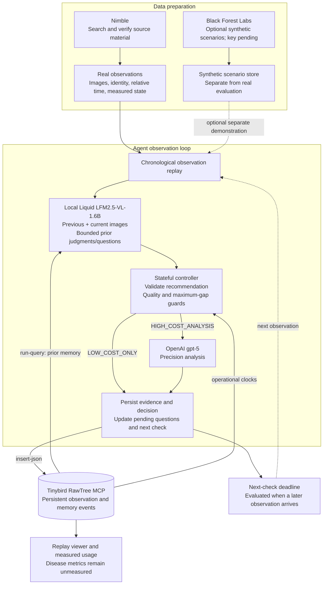

# Long-Horizon Tomato Observation Agent

Updated: 2026-09-25

The implementation includes an 18-image tomato RGB benchmark, local Liquid and cloud GPT-5 inference, persistent memory through RawTree MCP, restart recovery, and replay reporting. The current temporal v6 agent sends previous/current images and stored judgments to Liquid before selecting a path. A local v6 late-pair spotcheck described real visible changes, but the first-image quality judgment was inconsistent. The planned small integration check verifies dataflow, not reliability; no cost savings are established for v6. Historical v1 A/C runs completed 18 observations each and did not reduce GPT-5 calls. Their results remain unchanged. See [runtime instructions](docs/runtime.md), [temporal algorithm](docs/temporal_algorithm.md), and [run-specific results](reports/results.md). Disease accuracy and equipment diagnosis have not been validated.

## 1. Project objective

**Track the same tomato over time, retain unresolved observations, and decide when to add expensive visual analysis to routine local inference. The objective is to reduce unnecessary inference costs while preserving useful anomaly detection.**

The active experiment concerns tomatoes. Earlier apple samples and experiments remain as historical integration evidence and are excluded from the tomato comparison.

## 2. Problem and scope

Repeated observations often contain similar images. Calling an expensive model on every frame consumes tokens, latency, and API spend even during stable periods. Conversely, skipping analysis indiscriminately can delay recognition of persistent changes. A single image cannot establish whether a previously observed mark has changed or whether a pending concern needs follow-up.

The controller therefore asks:

> Given this tomato's earlier observations and analysis, does the current observation justify precision analysis? Is the local observation sufficient, or should a pending concern be revisited?

The MVP selects inference paths using pretrained models. It does not select training samples, retrain a disease model, or implement reinforcement learning. It tracks visible abnormalities rather than confirming internal infection or a pathogen. Normal ripening, illumination, and occlusion are potential confounders. Ending on the local path is not confirmation that the tomato is healthy.

## 3. Two-path observation loop

For the proposed agent (variant C):

**Restore earlier RawTree memory → give Liquid the immediately previous and current photos plus bounded prior judgments/questions → validate its recommendation → finish locally or add GPT-5 → persist updated memory.**

| Path | Execution | Selection |
| --- | --- | --- |
| `LOW_COST_ONLY` | Liquid only; no GPT-5 call | Valid local recommendation with sufficient visible evidence, or an unusable image requesting recapture/review |
| `HIGH_COST_ANALYSIS` | Liquid followed by GPT-5 | Local recommendation for another opinion, invalid/uncertain local evidence, or maximum precision gap |

The expensive path includes both calls. Liquid now proposes an action with an evidence-based reason and temporal-change assessment. The controller validates that proposal and applies quality and maximum-gap guards. It does not force GPT-5 merely because this is the first observation or a stored question is due.

Liquid receives two ordered photos after the first observation, timing, bounded prior GPT/local evidence, and at most three pending questions. The first image has no fabricated history and can finish locally. A LOW result still updates the immediately previous image and local judgment for the next comparison. This is visual comparison by a model, not a quantitative lesion-growth measurement.

Liquid reports exactly `quality`, `change_level`, `evidence`, and `recommendation`; evidence also supplies the recorded reason. A controller template maintains local follow-up questions, explicitly tagged as controller-generated. Local review does not postpone existing deadlines or close concerns without a successful GPT judgment. Unusable pictures require review/recapture and preserve unresolved questions. No LOW result certifies health. The maximum precision gap starts at the first observation when no successful GPT result exists, and otherwise at the last successful GPT analysis.

GPT-5 receives the original current image and, for C, a bounded prior summary/evidence plus at most one prior reference image. Its structured response can keep a concern open, close it as a model judgment, request review, or set a follow-up interval. This is not verified disease confirmation.

The controller maintains separate last-observation, last-local-analysis, and last-precision-analysis times. Frequent Liquid calls do not automatically postpone precision follow-up.

The older [Liquid routing prototype](liquid/routing.py) used apple responses and earlier action rules. The active integrated controller is [tomato_agent/policy.py](tomato_agent/policy.py), with replay and recovery in [tomato_agent/runner.py](tomato_agent/runner.py).

## 4. Architecture



Images remain in local files or a separate object store; RawTree stores their references and event metadata. Actual RawTree connection and write/read evidence is documented in [the integration record](docs/tinybird_memory.md).

The implemented runtime is a chronological replay. It checks stored deadlines when observations arrive. A production camera scheduler that wakes independently at a deadline remains future work. Old images must not be represented as newly acquired observations.

Each agent observation normally has one Liquid call and at most one additional GPT-5 call. Failed calls are recorded separately and are not interpreted as completed healthy observations. A uses GPT-5 directly as the comparison baseline.

## 5. Persistent memory and the long horizon

**Memory = prior observations + unresolved questions + the next task.**

Memory is external, durable state rather than an assumption that a model retains its internal state between calls.

| Memory component | Purpose |
| --- | --- |
| Current summary | Last observation and analysis, evidence, current concern |
| Relevant history | Immediately previous observation image for Liquid, plus the last precision-analysis image for GPT-5 |
| Pending questions | What to check, when it is due, whether it remains open |

Neither model receives the full archive. C restores the latest earlier state: Liquid receives previous/current photos and bounded judgments/questions, while GPT-5 retains its separate bounded precision summary and reference image. Original observation IDs preserve the connection to evidence.

For example, a small mark may leave an open question about persistence. A later observation resumes that question when the deadline is reached. Its result updates the next deadline or closes the question as a model assessment. This example describes workflow, not a validated biological progression rate.

`LOW_COST_ONLY` updates the previous image, local evidence, pending-question state, and successful Liquid timestamp without inventing a new precision result. Run-specific memory prevents one experimental variant's results from entering another. Persisted state supports resuming a suspended decision after a process restart.

## 6. Models and sponsor roles

The active model choice is **Liquid for local observation and `gpt-5` for precision analysis**. GPT-4.1-mini is not the active low-cost model. BFL remains an optional generation tool rather than a disease-analysis backend.

| Component | Role | Verification boundary |
| --- | --- | --- |
| Liquid `LFM2.5-VL-1.6B` | Local image observation | Installed and exercised on real inputs; disease accuracy unvalidated |
| Guarded controller | Validate Liquid recommendation and maintain follow-up state | Temporal v2 offline tests passed; real integration check in progress |
| OpenAI `gpt-5` | Precision image analysis | Real inference and usage capture exercised; not a ground-truth diagnosis |
| Tinybird RawTree MCP | Observation, call, decision, and memory persistence | Real connection and write/read operations exercised |
| Nimble | Dataset search and source verification | Authentication, search, and extraction exercised; tomato search records in `data/catalog/tomato_quick/` |
| Black Forest Labs | Optional synthetic stress scenarios | Key pending; no generation execution claimed |

### Liquid configuration

- Model repository: `LiquidAI/LFM2.5-VL-1.6B-GGUF`; `Q4_K_M` backbone and `Q8_0` projector.
- Runtime: llama.cpp `b11191`, `127.0.0.1:18081`, maximum input edge 512px, `image-max-tokens=256`, context 4096, one parallel slot.
- The runtime owns its spawned server and shuts it down on normal completion or error. It refuses an occupied port rather than terminating another process.
- Historical four-image apple test: median request latency **2.19 seconds/image**, observed peak server RSS **1.33 GiB**, inference API charge **$0**. This excludes electricity, device cost, startup, and resizing. See [Liquid experiment details](liquid/README.md).
- Temporal v2 validates the local recommendation and preserves deterministic safety guards. Expanded structured-output compliance requires real-run verification. Apple measurements are not tomato accuracy evidence.
- Resizing can remove small visual features. Preserve originals for GPT-5 and validate resolution effects in a separate labeled experiment.

### Credentials and provenance

Liquid inference needs no OpenAI key. The GPT adapter supports `OPENAI_API_KEY` and the existing `OPEN_AI_API_KEY` alias. Credentials are not written to logs, documentation, database events, or commits. The runtime preserves the requested `gpt-5` model and records prompt and usage metadata. Model/settings changes should use a new experiment version rather than silently mixing configurations within a resumed run.

The active sponsor integrations are **Liquid + Tinybird RawTree + Nimble**. Actual integration evidence and competition acceptance are distinct; OpenAI is not automatically counted as a sponsor. BFL scenarios, if added, must carry `synthetic=true` and must not serve as evidence of real disease performance.

## 7. Data and observation contract

Prefer independent specimens, real sequences, documented observation intervals, and supported labels over raw image count. Require stable identity and actual time or reliable order. Use environmental values only when matched to the specimen or storage experiment; missing values remain missing. Preserve source, license, hashes, and extraction provenance. Never concatenate unrelated still photographs into a claimed real sequence.

| Field | Meaning |
| --- | --- |
| `dataset_id`, `sequence_id`, `entity_id`, `observation_id` | Dataset and specimen/observation identity |
| `elapsed_seconds` | Relative time derived from the documented observation order/interval |
| `observed_at` | Actual timestamp when available; otherwise null |
| `frame_uri`, `frame_sha256` | Original image location and integrity check |
| `state` | Matched environmental measurements and metadata |
| `label`, `label_source`, `label_available_at` | Evaluation-only truth, provenance, and availability time, if known |
| `synthetic` | Separate generated scenarios from real observations |

The loader removes label fields recursively before model use. Current inference uses RGB and C's bounded earlier evidence; environmental values are stored and displayed but do not yet influence model prompts or routing rules. Future sensor-aware experiments require a separate version and equal observation availability across variants.

| Dataset | Role | Status and limitations |
| --- | --- | --- |
| [18-day tomato observations](https://zenodo.org/records/21943147) | Active replay demonstration | RGB sequence and environmental records collected locally. One specimen, 18 RGB observations; source also contains UV images. CC BY 4.0. No verified disease onset or pathology labels |
| [TR-6](https://pmc.ncbi.nlm.nih.gov/articles/PMC12925515/) | Additional collection/catalog, separate from benchmark | All 2,244 Normal tomato RGB source files (4,163,502,423 bytes) were downloaded, integrity-verified, and stored as metadata in RawTree. Database readback confirmed 2,244 IDs, zero duplicate rows, and 2,243 distinct image hashes across 48 filename dates. CC BY 4.0 verified. Classified duplicates Normal RGB by basename/CRC/size. Physical identity and per-image view alignment remain unverified; see [source audit](docs/tr6_data_audit.md) |

TR-6 image counts are not independent specimen counts or time points. Multiple camera views at one time must not be ordered as temporal progression. A one-specimen sequence is insufficient for generalization claims.

Earlier `data/samples/apple_browning_fuji/` frames and [apple collection records](data/catalog/README.md) are historical artifacts, excluded from active tomato evaluation.

## 8. Storage and recovery

The active event store uses the `tomato_lha_` table prefix. Events contain stable IDs, `run_id`, specimen identity, relative time, version, and the canonical event payload.

| Record | Contents |
| --- | --- |
| `observations` | Image reference, identity, time, measured state |
| `agent_events` | Chosen path, explicit trigger rules, evidence, call references |
| `memory_events` | Complete versioned state, pending questions, next deadline |
| `model_calls` | Model/prompt version, usage, latency, cost estimate, attempt ID |
| `evaluation_results` | Reserved record type for experiment metrics |

Dataset catalogs remain provenance records; their presence does not imply a deployed catalog table for every source. Historical apple catalog data is retained separately.

The store writes a local durable journal and verifies remote persistence. An outbox survives remote failures. Paid requests have durable intent records; adapters fsync their response logs before returning. A logged response can be recovered after interruption before the event append. An unmatched paid intent blocks automatic repetition because its outcome is unknown. Unknown billing blocks further paid requests. Single-writer operation is required per run. New configurations pin code/prompt hashes, model/settings, and local runtime artifact size/mtime; changed or legacy configurations cannot resume under v6. Use a new run ID and preserve historical results.

## 9. Primary comparison and success criteria

| Primary arm | Execution | Purpose |
| --- | --- | --- |
| Baseline (A) | GPT-5 directly on every photograph; no Liquid | Always-precision reference |
| Our agent (C) | Liquid compares consecutive photos and persisted judgments; validated recommendation decides whether to add GPT-5 | Proposed system |

The primary comparison is **Baseline versus Our agent** on the same complete observation sequence. Report actual GPT-5 calls, model-specific usage, and estimated cloud API costs. Do not assume the agent saves money: local recommendations and safety guards may still trigger precision analysis on every observation, while memory/reference images add input tokens.

An existing B run (selection without semantic memory) is retained only as an auxiliary historical experiment. It is not a third arm of the primary comparison. Any later B/C memory ablation must share identical cached Liquid outputs or otherwise account for output variation; independent calls do not isolate memory's causal effect.

Use the same real observation stream and precision model/output contract. Record the agent policy version explicitly; Baseline A is always-precision and does not use the agent routing policy. No future frame or future label may enter a prediction. For scientific evaluation, tune on development specimens and evaluate on held-out specimens with independent labels. That evaluation has not been completed by this demonstration.

### Cost accounting

```text
GPT-5 call reduction = 1 - (C GPT-5 calls / A GPT-5 calls)
Cloud inference API cost reduction = 1 - (C estimated cloud API cost / A estimated cloud API cost)
```

Record every model call, including failed requests with returned usage. Report each model's input/output tokens separately; cached and reasoning tokens must be accounted for without double charging. Price-based estimates are not invoices. Local API charges of zero do not mean zero total operating cost. Electricity, device costs, and unmeasured infrastructure costs remain unmeasured.

Nimble collection and optional BFL generation are preparation costs, reported separately unless invoked during the runtime. Do not report unknown costs as measured zero. Baseline local storage and agent RawTree storage also prevent claiming a controlled end-to-end latency comparison across those backends.

### Quality and limitations

Desired future metrics are anomaly recall, false-positive rate, and time to first warning against verified onset. Current disease metrics remain null because independent disease labels and onset are unavailable. GPT-5 output is not ground truth.

The demonstration can establish chronological execution, unresolved-question follow-up, call counts, measured usage, and recovery behavior. Cost reduction alone does not establish detection quality preservation.

## 10. Implemented workflow and remaining work

Implemented: data collection/normalization, chronological replay, Liquid/GPT-5 adapters, explicit routing, RawTree event persistence, durable recovery, offline tests, and an interactive report from actual run records. Read [results](reports/results.md) for final run-specific status; this plan does not invent results for unfinished runs.

Remaining work includes independent labeled multi-specimen evaluation, controlled memory ablations, sensor-aware inference, a production acquisition scheduler, and optional BFL stress scenarios. Quantitative lesion-growth detection, disease confirmation, and equipment-fault diagnosis are not implemented claims.

## 11. Sources and implementation evidence

- [Runtime instructions](docs/runtime.md)
- [Measured results](reports/results.md)
- [Liquid local experiment](liquid/README.md)
- [Liquid model card](https://huggingface.co/LiquidAI/LFM2.5-VL-1.6B-GGUF)
- [OpenAI GPT-5](https://developers.openai.com/api/docs/models/gpt-5)
- [Black Forest Labs image editing](https://docs.bfl.ai/flux_2/flux2_image_editing)
- [RawTree official MCP reference](https://rawtree.com/docs/reference/mcp)
- [RawTree connection evidence](docs/tinybird_memory.md)
- [Nimble onboarding](https://llms.nimbleway.com/agent-onboarding)
- [Nimble Search](https://docs.nimbleway.com/nimble-sdk/web-tools/search.md)
- [Nimble Extract](https://docs.nimbleway.com/nimble-sdk/web-tools/extract/quickstart.md)

See the [temporal validation record](reports/temporal_validation.md) for preserved development trials, observed limitations, and the subsequent integration-check status.
