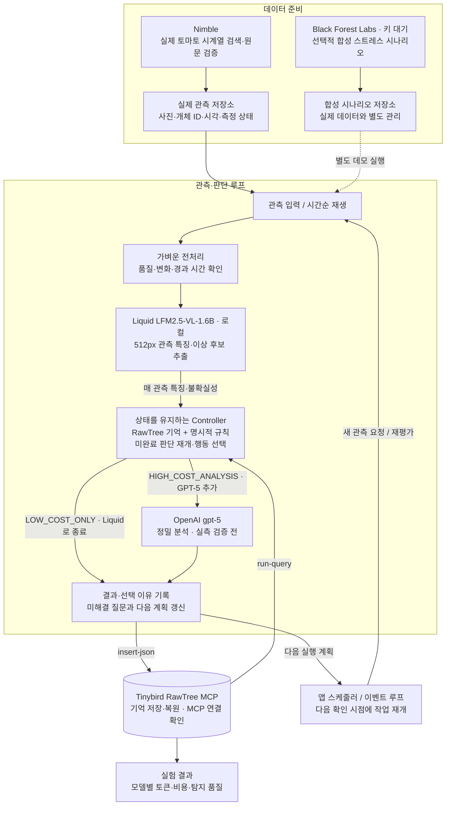

# 장기 기억 기반 토마토 이상 관측 에이전트

작성일: 2026-09-25  
현재 구현: 토마토 RGB 18장·환경 기록 수집, Liquid/GPT-5 실제 추론, 두 경로 Controller, RawTree MCP 기억 저장·복원, 재시작 복구, A/B/C 재생 및 비교 화면을 구현했다. 실행 방법은 [runtime.md](docs/runtime.md), 실측 결과는 [results.md](reports/results.md)에 정리한다. 아래는 구현 전 계획을 보존한 것으로, 하단의 “미구현·미검증” 상태는 당시 기록이다. 질병 정확도와 설비 진단은 아직 검증하지 않았다.

## 1. 프로젝트 한 문장

**같은 토마토의 변화를 시간에 따라 기억하고, 지금 AI 분석이 필요한지와 어느 수준의 분석을 실행할지 결정하여, 이상 탐지 품질을 유지하면서 불필요한 추론 비용을 줄이는 Long-Horizon Agent.**

대상은 **토마토만**이다. 동일 토마토의 실제 시간 변화, 부패·갈변·이상 후보를 관측한다. 이번 데이터 수집과 평가에 다른 과일·작물을 포함하지 않는다.

## 2. Problem Statement

토마토의 상태를 지속적으로 관찰하면 비슷한 사진이 반복해서 들어온다. 모든 관측을 고비용 시각 모델로 분석하면 변화가 거의 없는 구간에서도 입력·출력 토큰, 처리 시간, API 비용을 반복 지출한다.

반대로 분석을 무조건 줄이거나 일정 간격으로만 실행하면, 작지만 지속되는 반점이나 변형을 늦게 발견할 수 있다. 현재 사진만으로 판단하면 이전에 발견한 작은 변화가 커지고 있는지, 보류한 의심을 다시 확인해야 하는지도 놓치기 쉽다.

따라서 해결할 질문은 다음과 같다.

> 이 토마토의 이전 관측과 분석 결과를 고려할 때, 지금 다시 분석할 가치가 있는가? 저비용 분석으로 충분한가, 정밀 분석이나 추가 확인이 필요한가?

핵심 과제는 다음 세 가지다.

1. 변화가 거의 없는 관측의 반복 분석을 줄인다.
2. 중요한 변화와 오래 해결되지 않은 의심을 이어서 확인한다.
3. 비용 절감이 탐지율 저하, 오탐 증가, 탐지 지연을 동반하는지 함께 측정한다.

### 문제의 범위

- 이번 MVP는 **이미 학습된 모델의 추론 시점·수준 선택**에 집중한다.
- 대표 학습 샘플 선별, 모델 재학습, 강화학습은 이번 핵심 범위에 포함하지 않는다.
- RGB로 관측할 수 있는 이상 후보를 추적한다. 관측 신호가 없는 내부 감염을 확진한다고 주장하지 않는다.
- 정상 숙성, 조명 변화, 가림과 실제 이상 후보를 구별해야 한다.
- 모든 관측은 Liquid로 분석한다. 저비용 분석으로 종료했다는 것은 정상으로 확진했다는 뜻이 아니다.

## 3. Solution

에이전트는 새 관측마다 Liquid를 실행하고, 현재 특징과 이전 관측·외부 기억을 비교하여 GPT-5 추가 분석 여부를 결정한다. 두 경로 모두 사진·관측 결과·기억·다음 확인 계획을 저장한다.

**매 관측 Liquid 실행 → 이전 관측·RawTree 기억 비교 → 저비용 종료 또는 GPT-5 추가 실행 → 기억 갱신**

| 분석 경로 | 의미 | 선택 조건 |
| --- | --- | --- |
| `LOW_COST_ONLY` | Liquid 분석으로 종료. GPT-5 호출 없음 | 비교 가능한 품질이며 정밀 분석을 요구하는 조건이 없음 |
| `HIGH_COST_ANALYSIS` | Liquid 분석 후 GPT-5 정밀 분석 추가 | 새로운 이상·불확실성, 지속/확대된 변화, 미해결 질문의 재확인 조건 도달, 최초 관측 또는 최대 정밀 분석 공백 도달 |

**고비용 경로도 Liquid를 먼저 실행하므로 비용은 Liquid + GPT-5다.** 관측을 통째로 생략하는 경로는 없다. RGB 변화량은 여러 신호 중 하나이며 단독으로 경로를 결정하지 않는다. 흐림·가림 등으로 비교가 불가능하면 `quality_status=unusable`, `review_required=true`로 표시하고 재촬영 과제를 남긴다. 이는 별도 비용 단계가 아니며, 정밀 호출을 하지 않은 경우 `LOW_COST_ONLY`와 품질 문제를 함께 기록한다. 이를 “변화 없음”이나 “정상”으로 해석하지 않고 미해결 과제를 유지한다.

행동의 최종 결정자는 **외부 기억을 읽는 Controller와 명시적 규칙**이다. Liquid는 보이는 특징과 이상 후보만 제공하며, Liquid의 `next_action`으로 기억 처리나 GPT-5 호출을 결정하지 않는다. 첫 구현은 변화량, 마지막 분석 이후 경과 시간, 미해결 질문, 검증된 관측 출력에 기반한 규칙으로 시작한다. 임계값은 검증 데이터에서 조정하고 버전을 기록한다. 모델이 말하는 자신감을 검증된 확률로 간주하지 않는다.

초기 관측과 장시간 분석이 없었던 경우에는 재확인 경로를 둔다. 이는 누락을 줄이기 위한 장치이며 탐지율을 수학적으로 보장하지 않는다.

### Liquid와 Controller의 역할

- Liquid: 매 관측마다 최대 변 512px 사진에서 `visible_anomaly=yes/no/uncertain`과 보이는 근거를 추출한다. 모델 설명은 추정으로 기록하고 내부 질병의 사실로 저장하지 않는다.
- Controller: RawTree에서 미해결 질문·마지막 정밀 분석·재검토 기한을 복원한다. 영상이 판독 가능할 때 새로운 이상/불확실 출력, 변화의 지속·확대, 미해결 질문의 재확인 시각·조건 도달, 최초 관측 또는 최대 정밀 분석 공백 도달, 출력 필수 필드 누락은 GPT-5 경로로 보낸다. 열린 질문이 있다는 이유만으로 매 관측마다 반복 호출하지 않는다. 이는 초기의 보수적인 정책이며 호출 절감률을 보장하지 않는다.
- 품질이 나빠 판독할 수 없으면 재촬영/사람 확인 과제를 남긴다. 같은 불량 영상에 정밀 호출을 무한 반복하지 않는다.
- GPT-5: 원본 이미지와 필요한 과거 근거를 받아 정밀 분석한다. 결과로 이전 질문을 해결하거나 다음 확인 조건·시점을 갱신한다.
- `last_observation_at`, `last_cheap_analysis_at`, `last_strong_analysis_at`을 분리한다. Liquid를 자주 실행해도 정밀 재검토 기한을 자동 연장하지 않는다.

현재 [liquid/routing.py](liquid/routing.py)는 저장된 사과 응답을 대상으로 검증한 이전 보호 규칙의 프로토타입이다. 기존 행동명·미해결 의심 즉시 승격 규칙을 사용하므로, 위 두 경로와 기한/조건 기반 정책을 구현할 때 별도 변경해야 한다. DB·스케줄러·GPT-5를 연결한 토마토 런타임이 이미 완성됐다는 의미는 아니다.


## 4. Architecture



### 실행 경계

- 이미지 원본은 로컬 파일 또는 별도 오브젝트 저장소에 보관한다. RawTree에는 이미지 위치와 관련 이벤트를 저장한다.
- RawTree MCP의 `insert-json`으로 기억 이벤트를 기록하고 `run-query`로 조회한다. 실제 읽기·쓰기 검증 상태는 [연결 기록](docs/tinybird_memory.md)에 남긴다.
- 다음 확인 시각을 저장하는 기능과 실제 작업을 깨우는 기능은 분리한다. 실행 재개는 앱 스케줄러/이벤트 루프가 담당한다.
- 한 관측마다 Liquid 1회를 실행하고, 고비용 경로이면 GPT-5를 최대 1회 추가한다. 실패·재시도는 별도 기록하며, 실패를 분석 완료나 정상으로 처리하지 않는다. Liquid 실행 자체를 생략하는 최적화는 이번 MVP 범위에 없다.
- 새 사진이 없는 재확인 시점에는 관측 부족을 기록한다. 과거 사진을 새 관측처럼 취급하지 않는다.

## 5. Long-Horizon Agent와 지속되는 기억

**기억 = 지난 관측 + 아직 풀지 못한 질문 + 다음 할 일**

기억은 모델이 실행 사이에 내부적으로 유지한다고 가정하지 않는다. 외부 저장소에서 복원 가능한 상태로 관리한다.

| 기억의 종류 | 보존할 내용 |
| --- | --- |
| 현재 상태 요약 | 마지막 관측, 마지막 분석, 현재 판단과 불확실성 |
| 중요한 변화 이력 | 기준 사진, 최초 이상 후보, 변화가 커진 시점과 근거 자료 |
| 미완료 과제 | 확인할 질문, 다음 확인 조건·시각, 해결 여부 |

전체 이력을 매번 프롬프트에 넣지 않는다. 개체별 요약과 미완료 과제를 우선 읽고, 필요한 과거 관측만 조회한다. 요약에는 원본 관측 ID를 연결해 근거를 다시 확인할 수 있게 한다.

### 예시: 같은 토마토의 보류한 판단을 이어서 처리

| 시점 | 관측·행동 | 기억 갱신 |
| --- | --- | --- |
| 09:00 | 작은 반점 발견. 저비용 분석으로 원인 확정 불가 | 사실: 반점 관측. 미해결 질문: 커지는가? 다음 과제: 후속 사진 비교 |
| 10:00 | 이전 메모와 사진을 읽고 변화가 지속되는지 확인 | 확대가 관측되면 정밀 분석 요청. 변화가 없으면 다음 확인 계획 조정 |
| 이후 | 새 분석 또는 확인 결과 도착 | 이전 질문 해결 여부 기록, 상태 요약과 계획 갱신 |

위 시각과 변화는 설명용 예시이며 실제 질병 진행 속도를 의미하지 않는다.

관측 사실, 모델 추정, 확인된 결과를 서로 다른 필드로 저장한다. 마지막 관측·Liquid 분석·GPT-5 정밀 분석 시각을 각각 관리한다. `LOW_COST_ONLY`에서는 관측과 성공한 Liquid 분석 시각만 갱신하며 마지막 정밀 분석 시각이나 정상 확진 결과를 만들지 않는다.

이 시스템의 long-horizon 성격은 오래 실행한다는 데 있지 않다. **개체를 추적하고, 판단을 보류하고, 다음 작업을 계획하고, 후속 결과로 이전 판단을 재개·수정하는 과정**에 있다. 프로세스 재시작 후에도 미완료 과제와 상태를 복원할 수 있어야 한다.

## 6. 현재 모델 구성과 스폰서 역할

사용자 결정: **저비용은 Liquid, 고비용은 GPT-5**. GPT-4.1-mini는 활성 저비용 경로에서 제외한다. 사용자가 말한 “GPT 5.0”의 API 모델 ID는 `gpt-5`로 고정한다. BFL은 선택적 이미지 생성용이다.

| 구성 | 역할 | 현재 확인 수준 |
| --- | --- | --- |
| Liquid `LFM2.5-VL-1.6B` | 로컬 저비용 관측 특징·이상 후보 추출 | M5 16GB에서 사과 4장 실험 완료. 토마토 성능 미검증 |
| Controller + RawTree 기억 | 행동 결정, 미해결 질문 관리, 다음 확인 계획 | 보호 규칙의 응답 재생 검사 완료. 토마토 통합 런타임 미구현 |
| OpenAI `gpt-5` | 원본·과거 근거 기반 정밀 분석 | 공식 이미지 입력 지원 확인. 프로젝트 추론·성능 미검증 |
| Tinybird RawTree MCP | 기억·관측·판단·사용량 저장/조회 | 실제 연결·사과 카탈로그 1건 쓰기/재조회 성공 |
| Nimble | 토마토 시계열 검색·원문 검증 | 실제 인증·검색·추출 성공. 토마토 빠른 검색 응답은 `data/catalog/tomato_quick/` |
| Black Forest Labs | 선택적 합성 스트레스 시나리오 | 키 대기. 실제 생성 호출 미실행 |

### Liquid 채택 설정과 근거

- 모델: `LiquidAI/LFM2.5-VL-1.6B-GGUF`, 본체 `Q4_K_M` + projector `Q8_0`.
- 런타임: llama.cpp `b11191`, 로컬 `127.0.0.1:18081`, 초기 입력 최대 변 512px, `image-max-tokens=256`, context 4096, 병렬 슬롯 1. 서버는 실험 종료 시 종료되므로 앱 실행 시 별도 시작이 필요하다.
- 기존 사과 4장 실험: 요청 시간 중앙값 **2.19초/장**, 관측 최대 서버 RSS **1.33 GiB**, 추론 API 청구액 **$0**. 전력·기기·서버 시작·리사이즈 비용은 포함하지 않는다.
- 행동 선택과 미해결 기억 지시 이행에서 실패가 발견됐다. 그래서 Liquid를 Controller로 사용하지 않는다.
- 512px 축소가 초기의 작은 이상을 없앨 수 있다. 원본은 보존하여 GPT-5에 제공하고, 토마토에서 해상도·미탐·지연을 검증한다.
- 상세 방법·결과·한계: [Liquid 실험 보고서](liquid/README.md). 사과 실험 결과를 토마토 정확도로 인용하지 않는다.

### 모델 ID와 키 처리

Liquid의 로컬 추론에는 OpenAI 키가 필요 없다. GPT-5용 앱 설정은 표준 `OPENAI_API_KEY`와 기존 `OPEN_AI_API_KEY` 별칭을 지원하도록 설계한다. 키는 문서·로그·DB·커밋에 남기지 않는다. `gpt-5`를 다른 버전으로 자동 변경하지 않고 모델·프롬프트·추론 설정을 기록한다. 이 설계 갱신에서는 모델 호출을 추가로 실행하지 않았다.

### 스폰서 조건

활성 설계의 세 스폰서는 **Liquid + Tinybird RawTree + Nimble**이다. Liquid 로컬 실험, RawTree 쓰기/조회, Nimble 검색의 실제 사용 기록은 있다. 대회 인정 조건과 토마토 통합 데모의 완료 여부는 별도 확인한다. BFL은 키 확보 후 선택적으로 추가하며 OpenAI를 대회 스폰서로 자동 계산하지 않는다.

BFL 합성 자료는 `synthetic=true`로 실제 평가와 분리한다. 생성한 병변을 실제 관측이나 정답으로 쓰지 않는다.

## 7. 데이터 확보와 관측 형식

### 수집 원칙

Nimble로 폭넓게 후보를 찾되, 이미지 총수보다 **독립 개체 수·실제 시퀀스 수·관측 기간·변화 유형·라벨 근거**를 우선한다.

1. 동일 토마토의 시간에 따른 변화 자료를 우선한다.
2. 정상 숙성·안정 상태와 부패·이상 변화를 함께 확보한다.
3. 개체 ID와 시각 또는 신뢰할 수 있는 순서가 필요하다.
4. 환경값은 해당 개체/구역에 실제 대응할 때만 사용한다. 없으면 결측으로 표시한다.
5. 출처, 라이선스, 파일 목록, 라벨의 근거와 공개 범위를 기록한다.
6. 임의의 정적 사진들을 이어 붙여 실제 시간 흐름으로 표현하지 않는다.

Nimble 검색 → 원문 추출 → 후보 카탈로그 → 작은 시퀀스 검증 → 적격 자료 수집 → 공통 관측 형식 변환 순으로 진행한다. 상세 검색문은 `README.md`에 정리한다.

### 공통 관측 필드

| 필드 | 의미 |
| --- | --- |
| `dataset_id`, `sequence_id`, `entity_id` | 출처와 동일 개체 추적용 식별자 |
| `observed_at` | 실제 관측 시각 또는 기준점 대비 경과 시간 |
| `frame_uri` | 사진 원본 위치 |
| `state` | 측정 환경값, 단위, 측정 시각, 적용 범위, 결측 표시 |
| `label`, `label_source`, `label_available_at` | 평가 정답, 근거, 당시 이용 가능했는지 판단할 시각 |
| `synthetic` | 실제 관측과 합성 시나리오 구분 |

정답은 평가 저장소에 분리하고, 당시 공개되지 않은 미래 라벨을 에이전트 입력에 전달하지 않는다. 시연에서는 실제 시각과 재생 시각을 분리하여 가속 재생한다.

### 현재 데이터 선정 상태

| 후보 | 용도 | 확인 수준 |
| --- | --- | --- |
| [18일 토마토 관측](https://zenodo.org/records/21943147) | 첫 시간순 재생·기억 데모 후보 | 동일 토마토 1개, RGB 18장 + UV 18장, 환경 기록. 공개 파일 목록 확인; 로컬 수집·라이선스 확인은 다음 단계 |
| [TR-6](https://pmc.ncbi.nlm.nih.gov/articles/PMC12925515/) | 주 실험 후보 | 논문상 토마토 RGB 2,244장·열화상 2,341장·가스 기록. 원본 개체/시각/각도 연결·중복·라벨 근거·라이선스 검증 후 확정 |

TR-6의 사진 수를 시간 시점 수나 독립 개체 수로 해석하지 않는다. 같은 시점의 여러 각도 사진을 시간 흐름으로 배열하지 않는다. 우선 RGB 기반 실험을 구성하고 센서값을 추가할 때에는 각 실험군에 같은 시점에 이용 가능한 측정만 제공한다.

18일 자료는 개체 1개의 반복 관측이라 일반화 성능 검증용으로 충분하지 않다. 질병 확진·발병 시점이 없는 자료에서는 질병 조기진단 성능을 주장하지 않는다.

기존 `data/samples/apple_browning_fuji/`의 사과 갈변 32프레임과 [사과 수집 기록](data/catalog/README.md)은 이전 검증 기록으로 보존한다. 현재 토마토 평가에는 포함하지 않는다.

## 8. RawTree 연결을 위한 논리적 기억 구조

토마토용 신규 테이블은 `tomato_lha_` 접두사를 사용하도록 설계한다. 기존 `apple_lha_dataset_catalog`의 사과 샘플 1건은 이전 연결 검증 기록으로 보존한다. 토마토 테이블은 아직 생성하지 않았다. 아래 이름은 앱에서 필요한 논리적 기록 유형이다. RawTree의 실제 테이블·API 이름으로 확인된 것은 아니며, 공개된 도구 스키마에 맞춰 매핑한다.

| 기록 | 내용 |
| --- | --- |
| `dataset_catalog` | 출처·라이선스·파일 정보·검증 상태·사용한 검색 도구 |
| `observations` | 개체·시각·이미지 위치·측정 상태 |
| `agent_events` | 판단에 사용한 관측, 행동, 이유, 당시 예측 |
| `memory_events` | 상태 요약, 미해결 질문, 다음 확인 계획과 버전 |
| `model_calls` | 실행 ID, 모델·프롬프트 버전, 토큰, 지연, 이미지 수, 과금 |
| `evaluation_results` | 실험군·평가셋 버전별 탐지 품질과 비용 |

기억은 버전이 있는 이벤트로 남기고 최신 상태를 조회한다. 재실행 시 같은 관측·호출을 중복 기록하지 않도록 ID를 둔다. 실험군별로 `run_id`와 기억을 분리하여 다른 실험의 결과가 유입되지 않게 한다.

## 9. 비교 실험과 성공 기준

| 실험군 | 동작 | 검증 목적 |
| --- | --- | --- |
| A. 항상 정밀 분석 | 모든 관측에 정밀 판독 모델 호출 | 기준 비용과 탐지 품질 |
| B. 장기 기억 없이 선택 | 현재 관측과 공통 재확인 규칙으로 분석 수준 선택 | 단순 선택만으로 얻는 효과 |
| C. 장기 기억으로 선택 | 개체별 이력·미해결 질문·이전 분석 결과까지 사용 | 제안 시스템 전체와 장기 기억의 효과 |

**A와 C**를 비교해 전체 절감 효과를 보고, **B와 C**를 비교해 장기 기억의 추가 효과를 본다. B에도 공통 시간 규칙을 실행하는 데 필요한 최소 운영 상태는 두되, 의미 있는 장기 관측 요약과 미해결 질문은 제공하지 않는다.

### 공정한 비교 조건

- 같은 실제 관측 시퀀스, 같은 정밀 판독 모델, 같은 판독 출력 형식과 평가 기준을 사용한다.
- B와 C는 매 관측 같은 Liquid 모델을 실행하고 같은 기본 정책을 사용한다. 장기 기억 사용 여부를 주된 차이로 둔다. A는 비교 기준으로 매 관측 GPT-5를 직접 호출한다.
- 모든 실험은 관측을 시간순으로 받고, 미래 영상·정답을 미리 사용하지 않는다.
- 정책·임계값은 개발용 개체에서 정하고, 별도 개체의 평가 시퀀스에서 고정해 비교한다.
- 공유 프레임·배경·촬영 구역 때문에 개체 간 정보가 섞이는지도 확인한다.

### 비용 계측

에이전트 판단, 이미지 분석, 기억 요약·갱신을 포함한 모든 모델 호출을 기록한다.

```text
GPT-5 호출 감소율 = 1 - (C의 GPT-5 호출 수 / A의 GPT-5 호출 수)
클라우드 추론 API 비용 절감률 = 1 - (C의 클라우드 추론 API 비용 / A의 클라우드 추론 API 비용)
```

Liquid와 GPT-5의 토큰은 모델별로 별도 보고한다. 주요 비용 지표는 GPT-5 호출 수·청구 대상 토큰·클라우드 API 비용이다. 로컬 지연·RSS·실행 횟수도 함께 공개한다. Liquid의 API 청구액 0달러를 전체 운영 비용 0달러로 해석하지 않으며, 전력·기기 비용이 미측정이면 총운영비 절감률은 미측정으로 남긴다. 토크나이저와 가격이 다른 모델의 토큰을 동일한 금액으로 환산하지 않는다. OpenAI 호출의 입력·출력·캐시·추론 토큰과 모델별 가격을 구분하고, 가격표 추정치와 실제 청구 확인값을 구분한다.

Nimble 수집과 BFL 시나리오 제작은 오프라인 준비 비용으로 별도 보고한다. 실행 중 호출한다면 해당 실행 비용에도 포함한다. 관측되지 않은 비용은 0으로 표시하지 않고 미측정으로 구분한다.

### 탐지 품질과 성공 판정

- 이상 사례 탐지율과 정상 사례 오탐률.
- 기준 이상 시점이 있는 경우 최초 경고까지의 지연.
- 미해결 질문의 재확인·해결 이력.
- 관측 수 대비 Liquid 호출 수, GPT-5 호출 수, 저비용 종료 비율, 총 지연.

비용만 줄었다고 성공으로 판단하지 않는다. 허용할 탐지율 저하·오탐·지연 범위를 개발 데이터에서 정하고, 그 범위를 유지하면서 평가 데이터의 비용이 줄어드는지 본다. 기준 시점이나 정답이 없으면 해당 탐지 지표를 계산하지 않고 동작 시연 결과로 표시한다.

## 10. MVP 실행 계획

1. **데이터 확보:** Nimble 연결과 실제 검색 호출을 검증하고, 적격 토마토 시퀀스를 선정한다.
2. **관측 재생:** 개체·시각·사진·상태를 연결해 실제 시계열을 재생한다.
3. **모델 연결:** 확정된 Liquid 관측 경로와 `gpt-5`를 같은 토마토 샘플에서 실행하여 추론·사용량을 검증한다.
4. **기억 구현:** RawTree MCP 기록·조회, 미해결 질문, 다음 확인 계획과 재시작 복원을 구현한다.
5. **에이전트 구현:** 분석 수준 선택, 결과에 따른 계획 변경, 과도한 호출 방지를 구현한다.
6. **BFL 시나리오:** 표시된 합성 스트레스 사례를 별도 데모로 추가한다.
7. **평가:** A/B/C를 재생하고 사용량과 탐지 품질을 비교한다.

데모에서는 같은 토마토에 대해 **매 관측 Liquid 분석 → 안정 구간은 저비용 종료 → 작은 변화 기록 → 후속 관측·기억 비교 → 필요 시 GPT-5 추가 → 기억 갱신**을 보여준다. 화면에서 현재 사진, 비교한 과거 관측, 미해결 질문, 선택 이유, 다음 확인 계획, 누적 사용량을 확인할 수 있게 한다.

### 남은 결정

- 실제 토마토 시계열 데이터와 평가 가능한 라벨.
- 두 모델의 실제 성능·비용·계정 접근 가능 여부.
- 재확인 간격, 변화 기준, 기억 검색·요약 예산.
- 평가용 탐지 품질 허용 범위.

## 11. 기능 확인에 사용한 공식 자료

- [Liquid 로컬 실험](liquid/README.md)
- [Liquid 모델 카드](https://huggingface.co/LiquidAI/LFM2.5-VL-1.6B-GGUF)
- [OpenAI: GPT-5](https://developers.openai.com/api/docs/models/gpt-5)
- [Black Forest Labs: 이미지 편집](https://docs.bfl.ai/flux_2/flux2_image_editing)
- [RawTree 공식 MCP](https://rawtree.com/docs/reference/mcp)
- [Nimble: 연결 안내](https://llms.nimbleway.com/agent-onboarding)
- [Nimble: Search](https://docs.nimbleway.com/nimble-sdk/web-tools/search.md)
- [Nimble: Extract](https://docs.nimbleway.com/nimble-sdk/web-tools/extract/quickstart.md)
